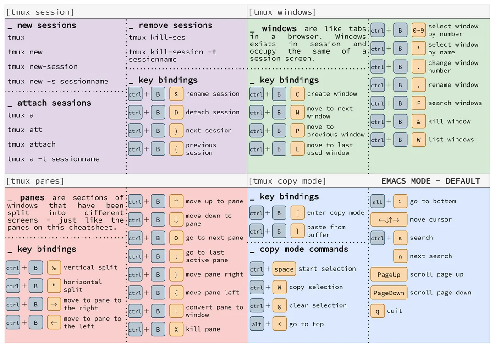

# 🖥️ `tmux` – Terminal Multiplexer (Linux) 

---

## 🧩 What is `tmux`?

`tmux` lets you run and manage **multiple terminal sessions** in a single window. You can:

- Split terminals (horizontally and vertically)
    
- Run persistent background sessions
    
- Create multiple windows and panes
    
- Reconnect to sessions even after disconnection (great for SSH)
    

---

## 🛠️ Installation

```bash
sudo apt install tmux
```

---

## ▶️ Start a New Session

```bash
tmux
```

---

## ⌨️ Basic Controls

> All `tmux` commands start with:  
> **Hold `CTRL`, press `B`, then release both**, and **press the next key as described**.

---

### 🔳 Splitting Panes

- **Horizontal Split (pane below)**
    
    ```text
    CTRL + B, release, then press SHIFT + "
    ```
    
- **Vertical Split (pane right)**
    
    ```text
    CTRL + B, release, then press SHIFT + 5 (which is the '%' key)
    ```
    

---

### ↔️ Navigating Between Panes

Use arrow keys to switch panes:

```text
CTRL + B, release, then press ↑ or ↓ or ← or →
```

---

### ❌ Close a Pane

Just type:

```bash
exit
```

in the pane you want to close.

---

## 🗂️ Working with Windows (like tabs)

- **Create a new window**
    
    ```text
    CTRL + B, release, then press C
    ```
    
- **Switch to next window**
    
    ```text
    CTRL + B, release, then press N
    ```
    
- **Switch to previous window**
    
    ```text
    CTRL + B, release, then press P
    ```
    
- **Switch to a specific window by number (0–9)**
    
    ```text
    CTRL + B, release, then press a number key (e.g., 0 or 1)
    ```
    
- **Rename current window**
    
    ```text
    CTRL + B, release, then press ,
    ```
    

---

## 📋 Managing Sessions

- **List all tmux sessions**
    
    ```bash
    tmux ls
    ```
    
- **Start a named session**
    
    ```bash
    tmux new -s session_name
    ```
    
- **Detach from current session (keep running in background)**
    
    ```text
    CTRL + B, release, then press D
    ```
    
- **Attach to an existing session**
    
    ```bash
    tmux attach -t session_name
    ```
    
- **Kill a session**
    
    ```bash
    tmux kill-session -t session_name
    ```
    

---

## 🛠️ Optional: Configuration via `.tmux.conf`

Create or edit `~/.tmux.conf` to customize your environment:

```bash
nano ~/.tmux.conf
```

Example content:

```bash
set -g mouse on
set -g history-limit 10000
setw -g mode-keys vi
```

Reload config manually:

```text
CTRL + B, release, then press :
```

Then type:

```text
source-file ~/.tmux.conf
```

---

Let me know if you'd like a cheat sheet image or `.tmux.conf` starter file

# **Complete tmux Tutorial: From Beginner to Advanced**

## **Beginner Level**

### **1. Creating a New tmux Session**

To create a new tmux session with a custom name:

```bash
tmux new-session -s session_name
```

**Short version:**

```bash
tmux new -s session_name
```

Example:

```bash
tmux new -s my_session
```

---

### **2. Detaching from a tmux Session**

To **detach** from the tmux session and leave it running:

**Shortcut:**

```
Ctrl + b, then d
```

---

### **3. Listing All tmux Sessions**

To list all active tmux sessions:

```bash
tmux list-sessions
```

**Short version:**

```bash
tmux ls
```

---

### **4. Attaching to a tmux Session**

To **attach** to an existing tmux session by name:

```bash
tmux attach-session -t session_name
```

**Short version:**

```bash
tmux a -t session_name
```

Example:

```bash
tmux a -t my_session
```

---

## **Intermediate Level**

### **5. Creating a New Window Inside tmux**

To create a new window in your tmux session:

**Shortcut:**

```
Ctrl + b, then c
```

---

### **6. Switching Between tmux Windows**

To switch between windows:

- **Next window**: `Ctrl + b, then n`
    
- **Previous window**: `Ctrl + b, then p`
    

To switch to a specific window by number (e.g., window 2):

```
Ctrl + b, then 2
```

---

### **7. Renaming a Window**

To rename the current window:

**Shortcut:**

```
Ctrl + b, then ,
```

---

### **8. Splitting Windows (Horizontal and Vertical)**

To **split** your tmux window into multiple panes:

- **Horizontal Split**: `Ctrl + b, then "`
    
- **Vertical Split**: `Ctrl + b, then %`
    

---

### **9. Navigating Between Panes**

To navigate between panes:

**Shortcut:**

```
Ctrl + b, then arrow keys (left, right, up, down)
```

---

### **10. Closing a Pane or Window**

To close the current pane:

**Shortcut:**

```
Ctrl + d
```

To close the current window:

**Shortcut:**

```
Ctrl + b, then &
```

---

## **Advanced Level**

### **11. Detaching and Reattaching to Multiple Sessions**

To **detach** from a session:

**Shortcut:**

```
Ctrl + b, then d
```

To **attach** to a session:

```bash
tmux attach-session -t session_name
```

**Short version:**

```bash
tmux a -t session_name
```

---

### **12. Killing a tmux Session**

To **kill** a tmux session:

```bash
tmux kill-session -t session_name
```

**Short version:**

```bash
tmux kill -t session_name
```

---

### **13. Resizing Panes**

To resize panes:

**Shortcut:**

```
Ctrl + b, then :resize-pane -D (down), -U (up), -L (left), -R (right)
```

For manual resizing using arrow keys:

**Shortcut:**

```
Ctrl + b, then hold `Ctrl` and use arrow keys
```

---

### **14. Synchronizing Panes (Send Input to All Panes)**

To synchronize panes and send the same input to all of them:

**Shortcut:**

```
Ctrl + b, then :setw synchronize-panes on
```

---

### **15. Saving and Restoring tmux Sessions**

To save and restore tmux sessions, you can use **tmux-resurrect** (a plugin) to automatically save and restore tmux windows and panes.

---

### **16. tmux Scripting and Automation**

You can automate tmux sessions with scripts. Example:

```bash
#!/bin/bash
tmux new-session -d -s my_session
tmux new-window -t my_session:1 -n 'Window1'
tmux send-keys -t my_session:1 'vim' C-m
tmux new-window -t my_session:2 -n 'Window2'
tmux send-keys -t my_session:2 'htop' C-m
tmux attach -t my_session
```

This script creates a session with two windows and opens `vim` and `htop` in them.

---

## **Summary of tmux Commands and Shortcuts**

|**Action**|**Command/Shortcut**|
|---|---|
|**Create new session**|`tmux new -s session_name`|
|**Detach from session**|`Ctrl + b, then d`|
|**List sessions**|`tmux ls`|
|**Attach to session**|`tmux a -t session_name`|
|**Create new window**|`Ctrl + b, then c`|
|**Switch windows**|`Ctrl + b, then n/p`|
|**Rename window**|`Ctrl + b, then ,`|
|**Split window horizontally**|`Ctrl + b, then "`|
|**Split window vertically**|`Ctrl + b, then %`|
|**Navigate between panes**|`Ctrl + b, then arrow keys`|
|**Close window or pane**|`Ctrl + d` or `Ctrl + b, then &`|
|**Resize panes**|`Ctrl + b, then :resize-pane`|
|**Synchronize panes**|`Ctrl + b, then :setw synchronize-panes on`|
|**Kill tmux session**|`tmux kill -t session_name`|

---

This is a **complete tmux tutorial** with essential commands, shortcuts, and advanced tips! Let me know if you need further assistance or more details on any topic!


